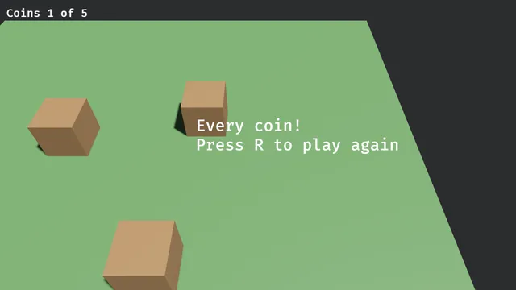
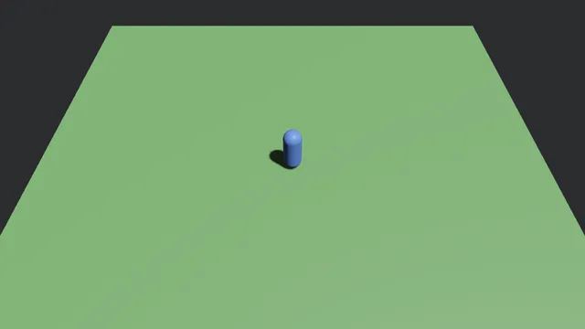
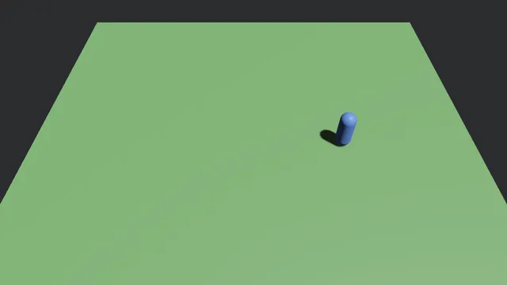
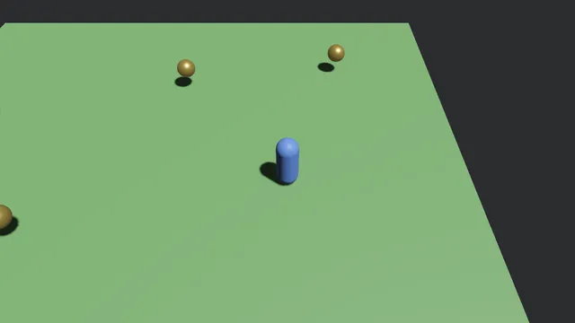
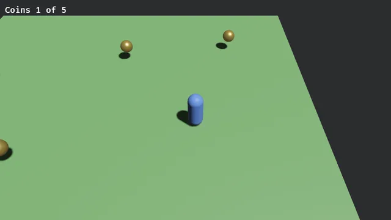
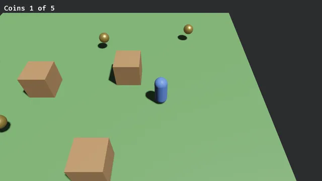
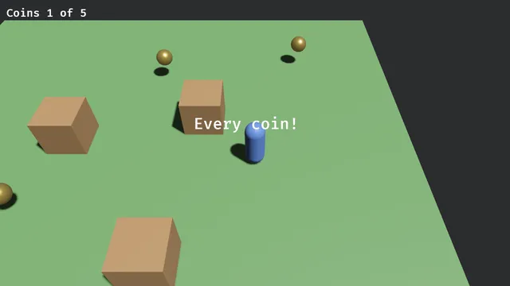

# A first game

This page makes a small game from an empty folder, a step at a time. A blue player walks a field,
gold coins float over it, crates stand in the way, a chime plays as each coin is taken, and taking
every coin wins, with R to play again. Each step adds a few lines and shows what the window shows
after them. The game is [`games/FirstGame`](../games/FirstGame) in this repository, where every
step is a whole program under `steps/`, and the pack workflow builds and runs each one on the
package, so none of them stops compiling.



## 1. A project

The engine's templates make a game to start from, and the empty one makes a window titled for the
project and nothing in it:

```bash
dotnet new install BevyCSharp.Templates
dotnet new bevycsharp-empty -o Coins && cd Coins
```

Its `Program.cs` is the window. `Config.Windowed` says its title and size, and `BevyApp.Run` runs
the game until the window is closed, with every `[Behavior]` the program declares found and run,
of which there are none yet:

<!-- step 01 -->
```csharp
using Bevy;

// A window, and everything in it is the behaviors below.
var config = Config.Windowed("Coins", 1280, 720);
return BevyApp.Run(config);
```

`dotnet run` opens it, empty.


## 2. A field, a sun and a camera

A `[Behavior]` struct is a component and the code that acts on it. A static method of one runs as
a system, once a frame, and `[OnStartup]` runs it once as the game starts instead, which is where a
field is laid out. The ground is a wide flat box drawn in a green material, the sun a directional
light shining down on it, and the camera looks at the middle of it from above and behind:

<!-- step 02 -->
```csharp
/// <summary>The field, its sun and the camera, made once as the game starts.</summary>
[Behavior]
public partial struct Field
{
    [OnStartup]
    public static void Build(BehaviorContext ctx)
    {
        var grass = Render.CreateMaterial((0.12f, 0.3f, 0.1f, 1f));
        ctx.Ecs.SpawnMesh(Render.CreateMesh(MeshShape.Cuboid, 20f, 1f, 20f), grass, Transform.At(0f, -0.5f, 0f));

        var sun = Render.SpawnLight(new LightSettings { Kind = LightKind.Directional, Intensity = 8000f });
        ctx.Ecs.Set(sun, Transform.LookingAt(new Vec3(4f, 10f, 3f), Vec3.Zero, Vec3.UnitY));

        var camera = Render.SpawnCamera3d();
        ctx.Ecs.Set(camera, Transform.LookingAt(new Vec3(0f, 12f, 10f), Vec3.Zero, Vec3.UnitY));
    }
}
```

`Transform.LookingAt` places a thing at a point turned toward another, the first number of a
position going right, the second up and the third toward the camera.


## 3. The player

The player is a component of its own, which tells its entity from the rest. A capsule standing on
the field is spawned with it, its middle 0.9 above the ground so its feet are on it:

<!-- step 03 -->
```csharp
/// <summary>The player.</summary>
[Behavior]
public partial struct Player
{
    [OnStartup]
    public static void Spawn(BehaviorContext ctx)
    {
        var look = Render.CreateMaterial((0.08f, 0.2f, 0.6f, 1f));
        var player = ctx.Ecs.SpawnMesh(Render.CreateMesh(MeshShape.Capsule, 0.35f, 1.1f), look, Transform.At(0f, 0.9f, 0f));
        ctx.Ecs.Add(player, new Player());
    }
}
```



## 4. Walking

A method that is not static runs once a frame for each entity carrying the component, here the
player alone. It may take other components of that entity after its context, `ref` to write one,
so it walks the player's transform by the keys held. `ctx.Time.Delta` is the seconds the last frame
took, so the player walks as fast however fast frames come, and the way is normalized, so walking
slantwise is no faster:

<!-- step 04 -->
```csharp
    [OnUpdate]
    public void Walk(BehaviorContext ctx, ref Transform place)
    {
        var x = (ctx.Input.KeyDown(Key.D) ? 1f : 0f) - (ctx.Input.KeyDown(Key.A) ? 1f : 0f);
        var z = (ctx.Input.KeyDown(Key.S) ? 1f : 0f) - (ctx.Input.KeyDown(Key.W) ? 1f : 0f);
        var way = new Vec3(x, 0f, z);

        // Four units a second, and no faster slantwise.
        if (way != Vec3.Zero) place.Translation += way.Normalized * 4f * ctx.Time.Delta;
    }
```



## 5. A camera that follows

The player says where it is in a static field, which every entity and system can read:

<!-- step 05 -->
```csharp
    /// <summary>Where the player is, for the camera and the coins.</summary>
    public static Vec3 At;
```

and sets it at the end of its walk:

<!-- step 05 -->
```csharp
        At = place.Translation;
```

The camera is given a component of its own in place of the place it was set at:

<!-- step 05 -->
```csharp
        var camera = Render.SpawnCamera3d();
        ctx.Ecs.Add(camera, new Follow());
```

and the component's method puts it behind and above the player each frame, so the player stays in
the middle of the window as it walks:

<!-- step 05 -->
```csharp
/// <summary>The camera, which looks down at the player from behind and above it.</summary>
[Behavior]
public partial struct Follow
{
    [OnUpdate]
    public void Look(BehaviorContext ctx, ref Transform place) =>
        place = Transform.LookingAt(Player.At + new Vec3(0f, 9f, 8f), Player.At, Vec3.UnitY);
}
```


## 6. Coins

Each coin remembers where it floats about, and floats up and down by the sine of the time, each a
little apart from the others by where it is. The ball and the gold are made once and shared by
every coin:

<!-- step 06 -->
```csharp
/// <summary>A coin, floating over the field.</summary>
[Behavior]
public partial struct Coin
{
    /// <summary>Where it floats about.</summary>
    public Vec3 Home;

    [OnStartup]
    public static void Scatter(BehaviorContext ctx)
    {
        var ball = Render.CreateMesh(MeshShape.Sphere, 0.35f);
        var gold = Render.CreateMaterial(new MaterialSettings { BaseColor = (1f, 0.75f, 0.15f, 1f), Metallic = 0.9f, Roughness = 0.3f });
        var places = new[] { new Vec3(4f, 0.9f, 0f), new Vec3(-4f, 0.9f, 2f), new Vec3(0f, 0.9f, -5f), new Vec3(6f, 0.9f, -6f), new Vec3(-7f, 0.9f, -3f) };
        foreach (var home in places)
        {
            var coin = ctx.Ecs.SpawnMesh(ball, gold, new Transform(home));
            ctx.Ecs.Add(coin, new Coin { Home = home });
        }
    }

    [OnUpdate]
    public void Float(BehaviorContext ctx, ref Transform place)
    {
        // Up and down by the sine of the time, each a little apart from the others by its place.
        place.Translation = Home + new Vec3(0f, MathF.Sin(ctx.Time.Elapsed * 3f + Home.X) * 0.15f, 0f);
    }
}
```



## 7. Taking them

The coins count how many there are and how many have been taken:

<!-- step 07 -->
```csharp
    /// <summary>How many there are, and how many have been taken.</summary>
    public static int All, Taken;
```

<!-- step 07 -->
```csharp
        (All, Taken) = (places.Length, 0);
```

and a coin the player comes within a unit of is taken. `ctx.Cmd` despawns it once the frame's
systems have run, since despawning it while they run would pull an entity from under them:

<!-- step 07 -->
```csharp
        if ((place.Translation - Player.At).Length > 1f) return;

        ctx.Cmd.Despawn(ctx.Entity);
        Taken++;
```


## 8. A count on screen

`Ui.SpawnText` puts words in the window, here in its corner, and a component on them finds them
again to say the count each frame:

<!-- step 08 -->
```csharp
/// <summary>How many coins have been taken, in the corner of the window.</summary>
[Behavior]
public partial struct Count
{
    [OnStartup]
    public static void Spawn(BehaviorContext ctx)
    {
        var text = Ui.SpawnText(string.Empty, new UiSettings { Absolute = true, Left = Length.Px(16f), Top = Length.Px(16f) }, 28f);
        ctx.Ecs.Add(text, new Count());
    }

    [OnUpdate]
    public void Show(BehaviorContext ctx) => Ui.SetText(ctx.Entity, $"Coins {Coin.Taken} of {Coin.All}");
}
```



## 9. Crates in the way

Physics is a plugin the program adds:

<!-- step 09 -->
```csharp
using Bevy;
using Bevy.Physics;

// A window, and physics for the crates. Everything in it is the behaviors below.
var config = Config.Windowed("Coins", 1280, 720);
return BevyApp.Run(app => app.AddPlugin(new PhysicsPlugin()), config);
```

A `RigidBody` and a `Collider` make an entity a body, its shape fitted to its mesh where no size is
given. The ground and the crates are bodies that do not move:

<!-- step 09 -->
```csharp
        var ground = ctx.Ecs.SpawnMesh(Render.CreateMesh(MeshShape.Cuboid, 20f, 1f, 20f), grass, Transform.At(0f, -0.5f, 0f));
        ctx.Ecs.Add(ground, new RigidBody { Kind = BodyKind.Static });
        ctx.Ecs.Add(ground, new Collider { Shape = ColliderShape.Box });
```

<!-- step 09 -->
```csharp
        // Crates to walk around, boxes that do not move.
        var crate = Render.CreateMesh(MeshShape.Cuboid, 1.5f, 1.5f, 1.5f);
        var wood = Render.CreateMaterial((0.35f, 0.2f, 0.08f, 1f));
        foreach (var (x, z) in new[] { (2f, -2f), (-3f, -1f), (1f, 4f), (-5f, 4f) })
        {
            var box = ctx.Ecs.SpawnMesh(crate, wood, Transform.At(x, 0.75f, z));
            ctx.Ecs.Add(box, new RigidBody { Kind = BodyKind.Static });
            ctx.Ecs.Add(box, new Collider { Shape = ColliderShape.Box });
        }
```

The player is a body that moves and a character, which walks where it is told and stops at what is
in its way:

<!-- step 09 -->
```csharp
        // A body the crates stop, walked by what it is told rather than pushed.
        ctx.Ecs.Add(player, new RigidBody { Kind = BodyKind.Dynamic, Mass = 70f });
        ctx.Ecs.Add(player, new Collider { Shape = ColliderShape.Capsule, Size = new Vec3(0.7f, 1.8f, 0.7f) });
        ctx.Ecs.Add(player, new CharacterController());
```

so it is walked by telling its controller which way, in units a second, rather than by moving its
transform, which the body now moves:

<!-- step 09 -->
```csharp
    public void Walk(BehaviorContext ctx, ref CharacterController body, in Transform place)
    {
        var x = (ctx.Input.KeyDown(Key.D) ? 1f : 0f) - (ctx.Input.KeyDown(Key.A) ? 1f : 0f);
        var z = (ctx.Input.KeyDown(Key.S) ? 1f : 0f) - (ctx.Input.KeyDown(Key.W) ? 1f : 0f);
        var way = new Vec3(x, 0f, z);

        // Four units a second, and no faster slantwise.
        body.Move = way == Vec3.Zero ? Vec3.Zero : way.Normalized * 4f;
        At = place.Translation;
    }
```


## 10. A chime

A sound is loaded once by its path under `assets`, which the package copies beside the game, and
played as each coin is taken:

<!-- step 10 -->
```csharp
    private static AssetHandle _chime;
```

<!-- step 10 -->
```csharp
        _chime = AssetServer.Load(AssetKind.Audio, "sounds/coin.wav");
```

<!-- step 10 -->
```csharp
        ctx.Cmd.Despawn(ctx.Entity);
        Audio.Play(_chime, AudioSettings.Effect);
```



## 11. Winning

A state is an enum the game is in one value of at a time. `[InitialState]` says which it starts in:

<!-- step 11 -->
```csharp
/// <summary>Whether the coins are still being taken, or every one has been.</summary>
[InitialState(Playing)]
public enum Mode
{
    Playing,
    Won,
}
```

`[InState]` runs a method only while the game is in a value, so the player stops walking and the
coins stop being taken once the game is won:

<!-- step 11 -->
```csharp
    [OnUpdate, InState(Mode.Playing)]
    public void Walk(BehaviorContext ctx, ref CharacterController body, in Transform place)
```

<!-- step 11 -->
```csharp
        if (++Taken == All) ctx.SetState(Mode.Won);
```

`ctx.SetState` moves the game to another value, and `[OnEnter]` runs a method as it does, which
says that every coin has been taken:

<!-- step 11 -->
```csharp
/// <summary>The words that every coin has been taken.</summary>
[Behavior]
public partial struct Won
{
    [OnEnter(Mode.Won)]
    public static void Say(BehaviorContext ctx)
    {
        var words = Ui.SpawnText("Every coin!", new UiSettings { Absolute = true, Left = Length.Percent(38f), Top = Length.Percent(40f) }, 40f);
    }
}
```



## 12. Again

What play spawns is spawned as play starts, rather than once as the game starts, and despawned as
it ends, so playing again starts from the beginning. The player and the coins are spawned on
entering `Playing`:

<!-- step 12 -->
```csharp
    [OnEnter(Mode.Playing)]
    public static void Spawn(BehaviorContext ctx)
```

<!-- step 12 -->
```csharp
        // Gone when play ends, and spawned again when it starts.
        ctx.Ecs.DespawnOnExit(player, Mode.Playing);
```

<!-- step 12 -->
```csharp
            ctx.Ecs.DespawnOnExit(coin, Mode.Playing);
```

and R plays again, the words despawned as the game leaves `Won`:

<!-- step 12 -->
```csharp
/// <summary>The words that every coin has been taken, and R to play again.</summary>
[Behavior]
public partial struct Won
{
    [OnEnter(Mode.Won)]
    public static void Say(BehaviorContext ctx)
    {
        var words = Ui.SpawnText("Every coin!\nPress R to play again", new UiSettings { Absolute = true, Left = Length.Percent(38f), Top = Length.Percent(40f) }, 40f);
        ctx.Ecs.DespawnOnExit(words, Mode.Won);
    }

    [OnUpdate, InState(Mode.Won)]
    public static void Again(BehaviorContext ctx)
    {
        if (ctx.Input.KeyPressed(Key.R)) ctx.SetState(Mode.Playing);
    }
}
```

The coins' `Scatter` starts on entering `Playing` too, and sets the count back to none. This is the
whole of [`games/FirstGame/Program.cs`](../games/FirstGame/Program.cs).


## Where next

[Behaviors](behaviors.md) has what a method runs as, when and over which entities,
[States](states.md) the rest of what states do, [Physics](physics.md) bodies, joints and rays,
[The interface](ui.md) words and panels, and [Audio](audio.md) sounds placed in the world.
[Making a game](making-a-game.md) builds a level in the editor and saves a game.

---

Next, [Behaviors](behaviors.md).
Its calls are each a line in the [cheatsheet](../CHEATSHEET.md). The [guide's contents](../README.md#guide) list every page.
